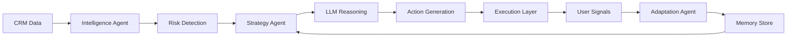

# 🚀 RevPilot AI  
### 🤖 Autonomous AI System for Sales & Revenue Operations  

<p align="center">
  <b>Detect 🔍 → Decide 🧠 → Act ⚡ → Learn 🔁</b><br>
  <i>AI that doesn’t just assist — it executes</i>
</p>

<p align="center">
  
  
  
</p>

---

## 🚀 Overview

<p align="center">
  
</p>

---

## 🎥 Demo

<p align="center">
  <a href="ADD_YOUR_VIDEO_LINK_HERE">
    ▶️ Watch Full Demo
  </a>
</p>

---

## 📸 Product Preview

<p align="center">
  
  
</p>

<p align="center">
  
  
</p>

---

## 🧠 Problem

💸 Sales teams lose revenue due to:
- Missed follow-ups  
- Generic outreach  
- Poor deal visibility  
- Late churn detection  

---

## 💡 Solution

RevPilot AI is a **multi-agent AI system** that:

✨ Identifies high-value prospects  
⚠️ Detects deal risks early  
✉️ Generates personalized outreach  
📉 Predicts churn  
📊 Quantifies business impact  

---

## ⚙️ Architecture



---

## 🤖 Multi-Agent System

- 🔍 Prospecting Agent → Finds & scores leads  
- ⚠️ Intelligence Agent → Detects risks  
- 🧠 Strategy Agent → Decides next actions  
- ✉️ Execution Layer → Generates outreach  
- 🔁 Adaptation Agent → Learns from signals  
- 📉 Retention Agent → Predicts churn  

---

## 🤖 Autonomous Execution in Action

<p align="center">
  
</p>

---

## ✨ Key Features

🎯 AI-driven prospecting  
⚠️ Deal risk detection  
✉️ Role-based sequences  
📉 Churn prediction  
⚔️ Competitive intelligence  
📊 Impact estimation  

---

## 📬 Communication & Engagement Intelligence

📨 Tracks:
- Email opened  
- Email replied  
- Response delays  

🧠 Uses signals to:
- Adapt strategy  
- Trigger follow-ups  
- Detect inactivity  

🚀 Future:
- Real email integration  
- Smart automation  
- Engagement analytics  

---

## 📬 Email Intelligence

<p align="center">
  
</p>

---

## 📊 Impact Model

⏱ 2 hrs saved per deal  
💰 ₹500/hour  

📈 Results:
- Higher conversions  
- Faster cycles  
- Reduced churn  

---

## ⚡ Setup & Run

```bash
git clone https://github.com/mekalakarthik05/revpilot-ai.git
cd revpilot-ai
python -m venv .venv
.venv\Scripts\activate
pip install -r requirements.txt
```

Create `.env`:
```
OPENAI_API_KEY=your_key_here
```

Run:
```bash
streamlit run app.py
```

---

## 🔮 Future Enhancements

🔗 CRM integrations  
📬 Email automation  
⚡ Real-time intelligence  
🧠 Advanced agent orchestration  
📊 Analytics dashboard  
🌐 Production UI  
🔐 Security  
🤖 Continuous learning  

---

## 🏁 Final Note

RevPilot AI transforms sales workflows into an **autonomous intelligence system** 🚀  
